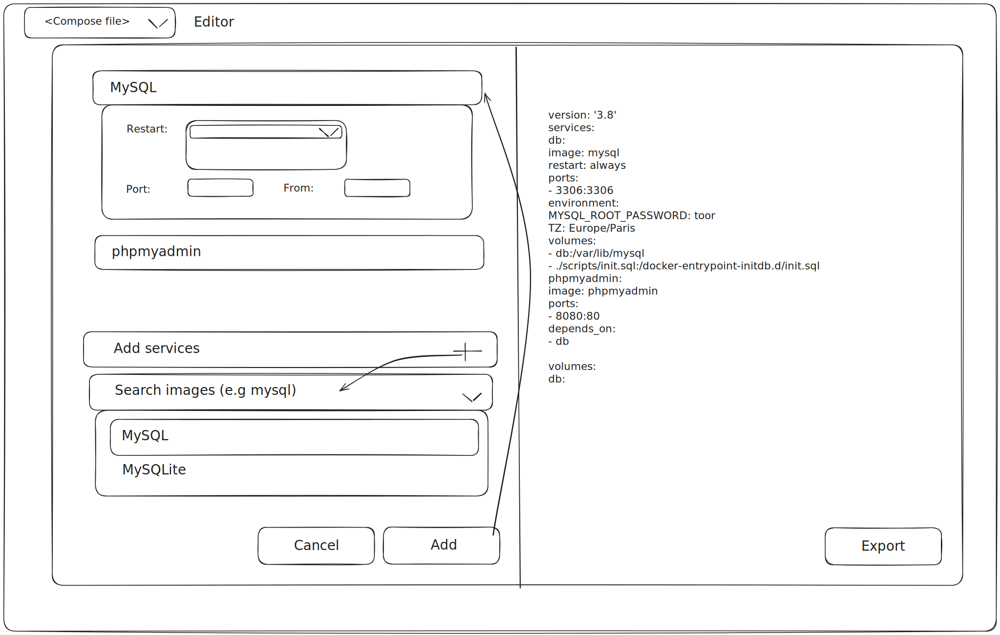
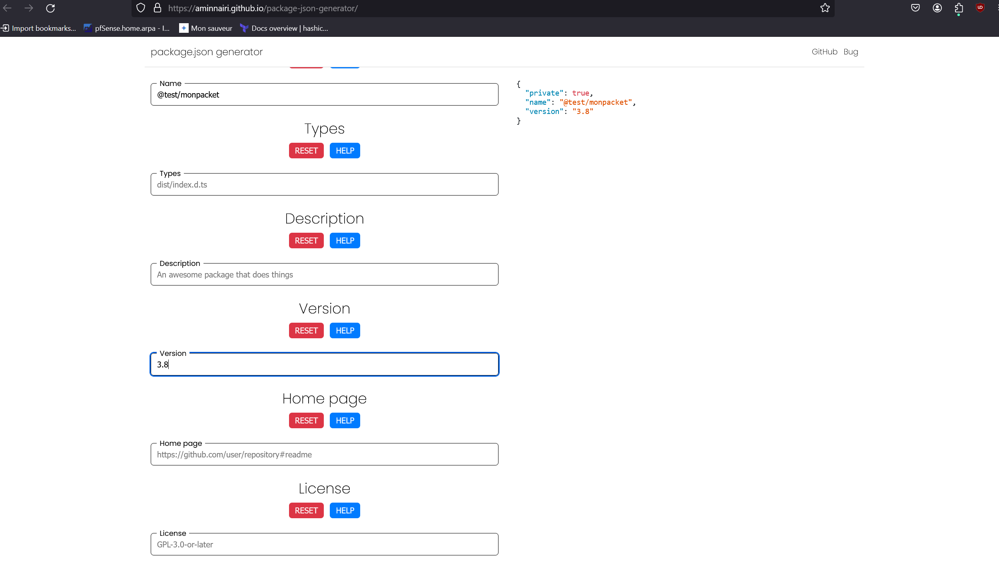

# Config Editor Kickoff Document:
## Executive Summary

Config Editor is a web application designed to simplify the creation and modification of configuration files. This tool will be invaluable to developers and system administrators alike, providing a user-friendly interface to manage complex configurations. As an open-source project, Config Editor is strategically positioned to contribute significantly to the ecosystem, fostering a community of collaborative development and innovation.

### Inspiration

Credit: [package-json-generator](https://github.com/aminnairi/package-json-generator)

## 1. Introduction

#### Purpose of the document:
This document serves to introduce the Config Editor project, outline its objectives, and provide a roadmap for its development and community engagement.

Goals for the open-source project kickoff: To launch the project with clear objectives, engage the developer community, and establish a foundation for ongoing open-source contribution and improvement.

## 2. Product Overview

High-level description of the product: Config Editor is an interactive web-based tool that allows users to easily create and edit configuration files through a guided interface.

Key features and benefits tailored to the open-source community:

- User-Friendly Interface: Simplifies the process of config file management, making it accessible to users of all skill levels.
- Modularity: Designed with a plug-and-play architecture to allow easy integration and customization.
- Community-Driven: Built for and by the community, encouraging contributions and feedback.

Target audience and potential use cases: Targeted primarily at software developers, DevOps professionals, and system administrators across various industries. Use cases include simplifying setup processes for applications, managing server configurations, and automating deployment tasks.
## 3. Technical Explanation
### 3.1 Architecture

#### Overview: 
Config Editor utilizes a modular architecture that supports extensibility and integration with various tools and platforms. It is based on microservices to ensure scalability and maintainability.

### 3.2 Features

#### Detailed breakdown:

- Visual Editor: Drag-and-drop elements and context-aware suggestions to simplify file creation.
- Syntax Validation: Real-time validation to prevent configuration errors.
- Version Control Integration: Seamless integration with Git to track changes and revisions.

### 3.3 Technology Stack

- Frontend: Nice GUI for a responsive and interactive UI.
- Backend: Fast API for API management.
- Storage: TBD
- Deployment: Docker for containerization and Kubernetes for orchestration.

### 3.4 Integration Points

- Integration with IDEs: Plugins for popular IDEs like VSCode and IntelliJ to enhance user experience.
- APIs for Custom Tools: Open APIs to allow other tools to interact with the config editor.

### 3.5 Security Measures

- Authentication: OAuth for secure access.
- Encryption: TLS for data in transit and at rest to ensure data integrity and confidentiality.

## 4. Community Engagement and Contribution
### 4.1 Value to the Open-Source Ecosystem

Config Editor aims to set a benchmark for open-source development tools by providing a robust, scalable, and flexible solution that enhances productivity and collaboration.

### 4.2 Contribution Guidelines

- Coding Standards: Adherence to common coding conventions and best practices.
- Submission Process: Pull requests via GitHub with required reviews and CI/CD checks.
- Review Criteria: Focus on code quality, innovation, and utility.

### 4.3 Community Support and Collaboration

- Forums and Chatrooms: Dedicated channels on platforms like Slack and Discord for real-time communication.
- Documentation and Tutorials: Comprehensive guides and video tutorials to aid new users and contributors.

### 4.4 Roadmap and Future Plans

- Using JSON Schemas: Implementing UI generation from JSON schemas to simplify preset creation.
- Planned Features: Customizable themes, more integrations with cloud services, and enhanced mobile support.

## 5. Implementation Plan

#### Development phases:

- Phase 1: Core functionality development and initial community building.
- Phase 2: Feature enhancements, security improvements, and beta release.
- Phase 3: Full-scale launch, based on community feedback and iterative improvements.

## 6. Risks and Mitigation Strategies

#### Potential risks:

- Community Engagement: Difficulty in attracting contributors.
- Technical Challenges: Integration complexities with diverse environments.

#### Strategies to address them:

- Engagement Initiatives: Regular community events and hackathons.
- Comprehensive Documentation: Detailed developer guides and API documentation.

## 7. Conclusion

The Config Editor project embodies a significant advancement in configuration management technology within the open-source community. We encourage developers, system administrators, and enthusiasts to join us in refining and expanding this tool, making it a cornerstone of the open-source ecosystem. Contributions, feedback, and active participation are highly welcomed to drive this project towards success.